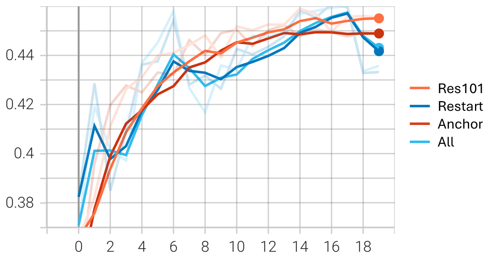
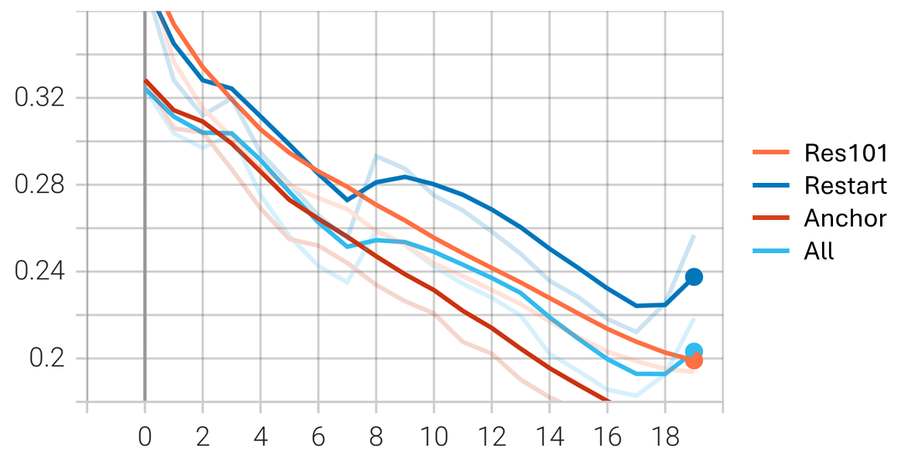

# NYCU DLVR HW2: Image Classification

>[!NOTE]
> Author: 何義翔 (Yi-Hsiang, Ho)  
> StudentID: 111550106

## Introduction

This task is to locate the digit in an image and recognize it using Faster R-CNN. The datasets are from this course, including 33,402 images for training/validation and 13,068 for testing. The core idea of this work is to leverage restart learning rate scheduler and adjust anchor aspect and size. ResNet-101 is chosen to be the backbone of the model.

## Requirement

- Python 3.12
- PyTorch 2.6.0 with CUDA 12.4
- TensorBoard
- tqdm
- pandas
- matplotlib

It is recommended to use virtual environment. You can use Conda, venv, etc. The following commands are for Conda.

```bash
conda create --name DLVR_HW1 python=3.12
conda activate DLVR_HW1
pip install torch torchvision torchaudio tensorboard tqdm pandas matplotlib
```

## How to use

### Train

To train the model with default settings (in NVIDIA GeForce RTX 4090, it needs about 8.5 hours to train):

```bash
python main.py --train
```

To test the model with best checkpoint:

```bash
python main.py --test
```

You can also specify `--device` to set the GPU ID. For more information about all arguments, please use `--help`.

## Performance

**Accuracy results of different models.** "Val" refers to validation. "Test pub." and "Test priv." refer to public and private test set, respectively. The highest values for each column are highlighted in bold.

| Method  | Val acc.   | Test pub. acc.  | Test priv. acc. | Val mAP    | Test pub. mAP   | Test priv. mAP |
| ------- | :--------: | :-------------: | :-------------: | :--------: | :-------------: | :-------------: |
| Res101  | 0.8063     | 0.7536          | 0.7557          | 0.4526     | 0.3686          | 0.3681          |
| Restart | 0.8045     | 0.7580          | 0.7564          | 0.4554     | **0.3770**      | **0.3777**      |
| Anchor  | 0.8168     | 0.7777          | 0.7727          | 0.4524     | 0.3720          | 0.3706          |
| All     | **0.8177** | **0.7840**      | **0.7810**      | **0.4581** | 0.3751          | **0.3777**      |

**Validation accuracy curve.**


**Validation mAP curve.**



**Training loss curve.**



For more detail and experiment, please see the [report](/report/report.pdf).

## Repository Structure

```
├── dataset.py              # Dataset loading and preprocessing
├── model.py                # Model architecture definitions
├── main.py                 # Main script
├── utils.py                # Utility functions
├── exp_src/                # Experimental implementations
│   ├── utils.py
│   ├── main_vanilla.py     # The original implementation of Faset R-CNN
│   ├── main_res101.py      # Change the backbone to ResNet101
│   ├── main_anchor.py      # Using custom anchor
│   └── ...
├── data/                   # Please place your dataset here
│   ├── train/              # Training set
│   ├── valid/              # Validation set
│   ├── test/               # Testing set
│   ├── train.json          # Ground truth bounding boxes and labels for training dataset, in COCO format
│   └── valid.json          # Ground truth bounding boxes and labels for valid dataset, in COCO format
└── report/                 # Project report
```

## License
This project is under MIT license, please see [LICENSE](LICENSE) for more detail.
